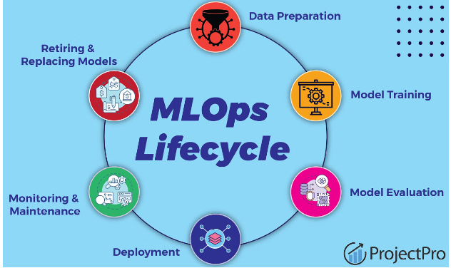

# StockPricePredictionAI

The aim of this project is to create a deployable model for stock price prediction. In order to make the model deployable, I will use the following architecture:

Notes: Bei Trainingspipeline kommt noch die Hyperparameteroptimierung mit Optuna, Model Quality Validation mit Backtesting, Model registry mit Gitlab MLFlow CI, ohne Canary Deployment. In der Deployment-Pipeline werden bestehende Modelle mit neu generierten Daten getestet und der Score in MLflow hochgeladen. Und Hyperparameteroptimierung findet nur in der CI statt und für jedes Modell einzeln.

Frage, Sollte das hochladen in jeder Modellklasse sein? Dann wird tag und alles in der Klasse gesetzt.

Entweder alle Modelle gepullt, nochmal trainiert bei continious training und continous deployment auf validate data reduzieren. Continious training einfach 

With this pipeline, I want to automize the full model lifecycle.

- Pre-Commit Hooks hinzufügen mit (Code Style Checks und Unittests)
- Poetry initialisieren

First steps:

1. Initialize poetry

Open the terminal in the project directory and use this commands:

- pip install poetry 
- poetry shell
- poetry install --no-root

Next steps could be...

- DVC instead of updating the DataFrame to MLflow